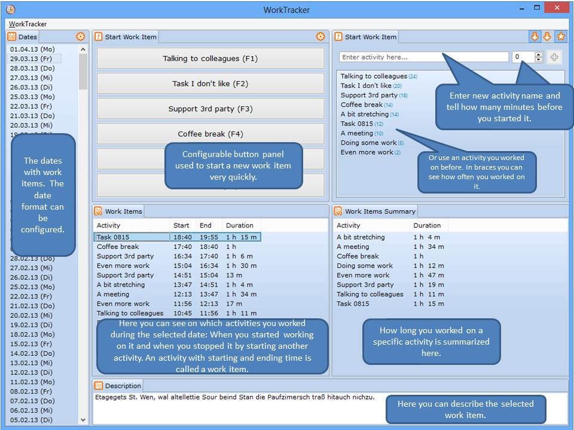

This program has been written to get to know Eclipse 4 RCP development, EMF and a bit ObservableLists and other cool stuff.

Nevertheless this program is very helpful and I use it on a daily basis.

Weekly I have to tell the company I work for, for which activities I spent how
much time. The WorkTracker helps enormously to record the spent time for
several activities. Every time I start working on a new activity I document it within
this tool. Many features make this very easy.
When the time comes that I have to explain how much time I spent for which activity,
this can be easily seen in the WorkTracker, e.g the program calculates the sum of durations
for each activity.

  
